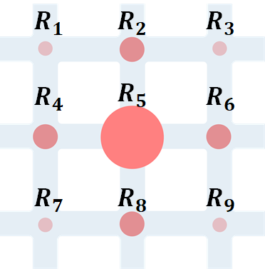

### $\gamma-Reward$ Algorithm for Multi-Agent


$$
\begin{array}{c}{R_{5}(t)=-r_{5}(t) \cdot\left\{1+\gamma \cdot\left[\operatorname{sigmoid} \sum_{i \in \mathcal{F}}\left(\frac{R_{i}(t-1)}{R_{i}(t-2)}-1\right)-0.5\right]\right\}} \\ {\mathcal{F}=\{2,4,6,8\}}\end{array}
$$


#### Environment Usage

`gym_cityflow`文档结构遵循 `gym` 环境的规则，详见[此处](https://medium.com/@apoddar573/making-your-own-custom-environment-in-gym-c3b65ff8cdaa)

使用前，`cd`到`gym_cityflow`目录，运行 `pip install -e .`进行环境包的安装。否则，无法在 `ray_dqn_agent.py` 中直接 `import gym_cityflow`

ray中可以自定义环境以及神经网络模型，详见[此处](https://github.com/ray-project/ray/blob/master/python/ray/rllib/examples/custom_env.py)


#### Configuration

`Config`包含 `agent_config` 和 `env_config`

1. `agent_config`：遵照 `ray` 中 [`agent/[algorithm].py`](https://github.com/ray-project/ray/tree/master/python/ray/rllib/agents)的 `DEFAULT_CONFIG` 以及 [`agents/trainer.py`](https://github.com/ray-project/ray/blob/master/python/ray/rllib/agents/trainer.py)的 `COMMON_CONFIG`，两者是继承关系，`DEFAULT_CONFIG`继承 `COMMON_CONFIG` 
2. `env_config`：为 `agent_config`字典下的一个属性，即其为大字典中的小字典，用于配置 `Cityflow` 环境参数


#### Future Research

Just change this part 

```python
    trainer = DQNTrainer(
        env=CityflowGymEnv,
        config=config_agent)
```

and 

```python
import ray.rllib.agents.dqn as dqn
from ray.rllib.agents.dqn import DQNTrainer
```

into your algorithm, then it would work.

**Remember:** Follow the `DEFAULT_CONFIG` in each algorithm and change your own configuration.